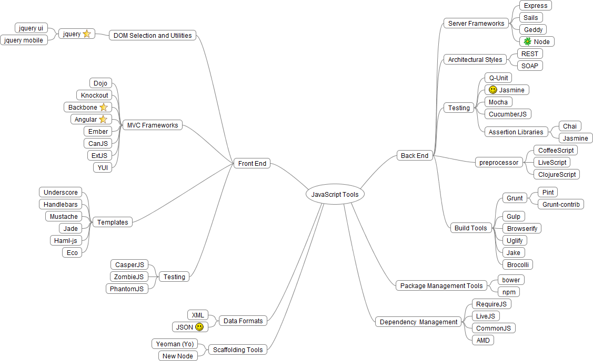

Java Script Master - Task 01
============================

Check you have following prerequisites

1. Github account 
2. GIT installled on workstation and GIT proxy settings working for you
3. Node.js installed `node -v` command works
4. NPM is available usually automatically installled with Node `npm -v` command works
5. Bower is installed `bower -v` works
6. http-server NPM module is installed
7. Gulp installed globally and you know Gulp `gulp -v` works
8. You know how to use Live reload
9. You know concat, util, uglify, coffee, less gulp modules
10. You have some understanding of Bootstrap 3
11.  You have done atleastt one program using CSS and LESS preprocesor
12. You have done one program using CoffeeScript
13. You know how to use jQuery and done one program with jQuery
14. You know what is KnockoutJS and have idea of what an observable is

